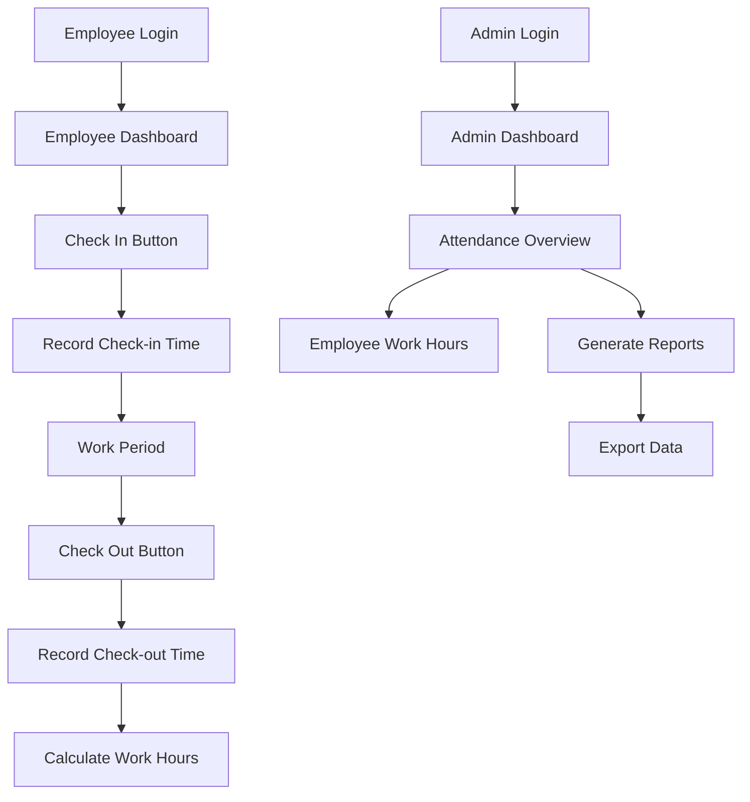

# Attendance Tracking System Requirements

## 1. Product Overview

Implement a comprehensive attendance tracking system that records employee check-in and check-out times, calculates work hours, and provides admin visibility into employee attendance patterns and total work time.

## 2. Core Features

### 2.1 User Roles

| Role       | Registration Method        | Core Permissions                                             |
| ---------- | -------------------------- | ------------------------------------------------------------ |
| Employee   | Existing employee accounts | Can check-in/check-out, view own attendance history          |
| HR Manager | Existing HR accounts       | Can view team attendance, generate reports                   |
| Admin      | Existing admin accounts    | Can view all employee attendance, manage attendance settings |

### 2.2 Feature Module

Our attendance tracking system consists of the following main components:

1. **Employee Dashboard**: Check-in/check-out buttons, current status display, personal attendance history
2. **Admin Dashboard**: Employee attendance overview, work hours summary, attendance reports
3. **HR Dashboard**: Team attendance monitoring, attendance analytics, export functionality
4. **Attendance API**: Backend endpoints for recording and retrieving attendance data

### 2.3 Page Details

| Page Name          | Module Name          | Feature description                                                                                 |
| ------------------ | -------------------- | --------------------------------------------------------------------------------------------------- |
| Employee Dashboard | Attendance Widget    | Display current attendance status (checked-in/out), show check-in/check-out buttons with timestamps |
| Employee Dashboard | Personal History     | Show employee's own attendance records, daily/weekly/monthly work hours summary                     |
| Admin Dashboard    | Employee Overview    | Display all employees' current status, total work hours per employee, attendance statistics         |
| Admin Dashboard    | Attendance Reports   | Generate and export attendance reports, filter by date range and employee                           |
| HR Dashboard       | Team Monitoring      | View team attendance patterns, identify attendance issues, track productivity metrics               |
| API Endpoints      | Attendance Recording | Handle check-in/check-out requests, validate timestamps, store attendance data                      |
| API Endpoints      | Data Retrieval       | Fetch attendance records, calculate work hours, provide analytics data                              |

## 3. Core Process

### Employee Flow

1. Employee logs into the system
2. Employee sees attendance widget on dashboard
3. Employee clicks "Check In" button to start work day
4. System records check-in time with timestamp
5. Employee works throughout the day
6. Employee clicks "Check Out" button to end work day
7. System records check-out time and calculates total work hours
8. Employee can view their attendance history

### Admin Flow

1. Admin logs into admin dashboard
2. Admin navigates to attendance management section
3. Admin views all employees' attendance data
4. Admin can filter by date range, employee, or department
5. Admin generates attendance reports
6. Admin exports data for payroll or HR purposes

## 4. User Interface Design

### 4.1 Design Style

* Primary colors: Use existing theme colors (blue/green accent)

* Secondary colors: Light gray backgrounds, white cards

* Button style: Rounded buttons with clear check-in (green) and check-out (red) colors

* Font: Existing system font with clear, readable sizes

* Layout style: Card-based design with clean spacing

* Icons: Clock icons for time tracking, calendar icons for history

### 4.2 Page Design Overview

| Page Name          | Module Name       | UI Elements                                                                                            |
| ------------------ | ----------------- | ------------------------------------------------------------------------------------------------------ |
| Employee Dashboard | Attendance Widget | Large check-in/out buttons, current time display, status indicator (green=checked-in, red=checked-out) |
| Employee Dashboard | History Section   | Table with date, check-in time, check-out time, total hours columns                                    |
| Admin Dashboard    | Employee Grid     | Cards showing employee name, photo, current status, today's hours, weekly total                        |
| Admin Dashboard    | Reports Section   | Date range picker, employee filter dropdown, export buttons (PDF, Excel)                               |

### 4.3 Responsiveness

Mobile-first design with touch-optimized check-in/check-out buttons for employees using mobile devices. Desktop layout provides comprehensive data views for admin users.

## 5. Technical Implementation Notes

### Database Schema Requirements

* Attendance table with employee\_id, check\_in\_time, check\_out\_time, date, total\_hours

* Indexes on employee\_id and date for efficient querying

* Validation to prevent duplicate check-ins without check-out

### API Endpoints Needed

* POST /api/attendance/check-in

* POST /api/attendance/check-out

* GET /api/attendance/employee/{id}

* GET /api/attendance/admin/overview

* GET /api/attendance/reports

### Security Considerations

* Validate user permissions before allowing attendance modifications

* Prevent time manipulation through client-side validation

* Log all attendance changes for audit purposes

* Implement rate limiting to prevent abuse

### Integration Points

* Connect with existing user authentication system

* Integrate with payroll system for work hours calculation

* Sync with HR management system for employee data

