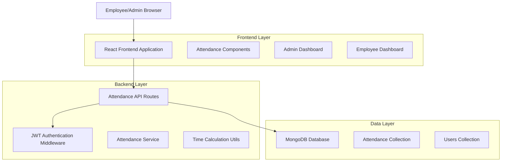
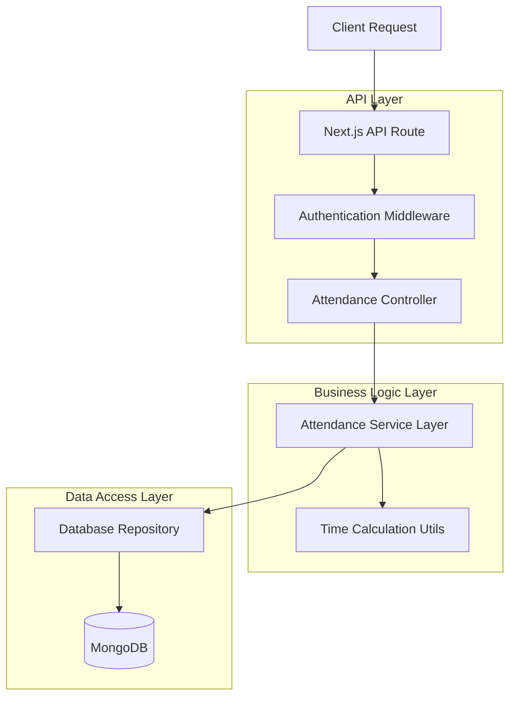
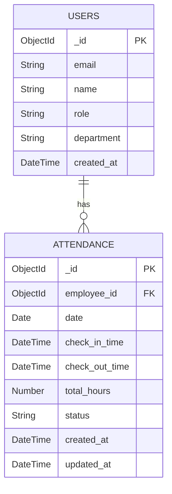

# Attendance Tracking System - Technical Architecture

## 1. Architecture Design



## 2. Technology Description

* Frontend: React\@18 + Next.js\@15 + TypeScript + Tailwind CSS

* Backend: Next.js API Routes + MongoDB

* Database: MongoDB (existing)

* Authentication: JWT (existing system)

* State Management: React Context + useState/useEffect

## 3. Route Definitions

| Route              | Purpose                                      |
| ------------------ | -------------------------------------------- |
| /employee          | Employee dashboard with attendance widget    |
| /admin             | Admin dashboard with attendance overview     |
| /hr                | HR dashboard with team attendance monitoring |
| /api/attendance/\* | Attendance-related API endpoints             |

## 4. API Definitions

### 4.1 Core Attendance API

**Check-in endpoint**

```
POST /api/attendance/check-in
```

Request:

| Param Name   | Param Type | isRequired | Description                             |
| ------------ | ---------- | ---------- | --------------------------------------- |
| employee\_id | string     | true       | Employee's unique identifier            |
| timestamp    | string     | false      | ISO timestamp (defaults to server time) |

Response:

| Param Name      | Param Type | Description                  |
| --------------- | ---------- | ---------------------------- |
| success         | boolean    | Operation status             |
| attendance\_id  | string     | Created attendance record ID |
| check\_in\_time | string     | Recorded check-in timestamp  |

Example Request:

```json
{
  "employee_id": "64f8a1b2c3d4e5f6a7b8c9d0",
  "timestamp": "2024-01-15T08:30:00.000Z"
}
```

Example Response:

```json
{
  "success": true,
  "attendance_id": "64f8a1b2c3d4e5f6a7b8c9d1",
  "check_in_time": "2024-01-15T08:30:00.000Z"
}
```

**Check-out endpoint**

```
POST /api/attendance/check-out
```

Request:

| Param Name   | Param Type | isRequired | Description                             |
| ------------ | ---------- | ---------- | --------------------------------------- |
| employee\_id | string     | true       | Employee's unique identifier            |
| timestamp    | string     | false      | ISO timestamp (defaults to server time) |

Response:

| Param Name       | Param Type | Description                  |
| ---------------- | ---------- | ---------------------------- |
| success          | boolean    | Operation status             |
| attendance\_id   | string     | Updated attendance record ID |
| check\_out\_time | string     | Recorded check-out timestamp |
| total\_hours     | number     | Calculated work hours        |

**Get employee attendance**

```
GET /api/attendance/employee/{employee_id}
```

Query Parameters:

| Param Name  | Param Type | isRequired | Description                               |
| ----------- | ---------- | ---------- | ----------------------------------------- |
| start\_date | string     | false      | Start date filter (ISO format)            |
| end\_date   | string     | false      | End date filter (ISO format)              |
| limit       | number     | false      | Number of records to return (default: 50) |

Response:

| Param Name           | Param Type | Description                     |
| -------------------- | ---------- | ------------------------------- |
| attendance\_records  | array      | List of attendance records      |
| total\_hours\_period | number     | Total hours in the period       |
| current\_status      | string     | "checked\_in" or "checked\_out" |

**Admin attendance overview**

```
GET /api/attendance/admin/overview
```

Query Parameters:

| Param Name | Param Type | isRequired | Description                                   |
| ---------- | ---------- | ---------- | --------------------------------------------- |
| date       | string     | false      | Specific date (ISO format, defaults to today) |
| department | string     | false      | Filter by department                          |

Response:

| Param Name | Param Type | Description                      |
| ---------- | ---------- | -------------------------------- |
| employees  | array      | List of employee attendance data |
| summary    | object     | Overall attendance statistics    |

## 5. Server Architecture Diagram



## 6. Data Model

### 6.1 Data Model Definition



### 6.2 Data Definition Language

**Attendance Collection Schema**

```javascript
// MongoDB Collection: attendance
const attendanceSchema = {
  _id: ObjectId,
  employee_id: ObjectId, // Reference to users collection
  date: Date, // Date in YYYY-MM-DD format for indexing
  check_in_time: Date, // Full timestamp of check-in
  check_out_time: Date, // Full timestamp of check-out (null if not checked out)
  total_hours: Number, // Calculated work hours (null until check-out)
  status: String, // "checked_in", "checked_out", "incomplete"
  notes: String, // Optional notes for the attendance record
  created_at: Date,
  updated_at: Date
}

// Indexes for performance
db.attendance.createIndex({ "employee_id": 1, "date": -1 })
db.attendance.createIndex({ "date": -1 })
db.attendance.createIndex({ "status": 1 })
db.attendance.createIndex({ "employee_id": 1, "check_in_time": -1 })
```

**Sample Data Insertion**

```javascript
// Sample attendance records
db.attendance.insertMany([
  {
    employee_id: ObjectId("64f8a1b2c3d4e5f6a7b8c9d0"),
    date: new Date("2024-01-15"),
    check_in_time: new Date("2024-01-15T08:30:00.000Z"),
    check_out_time: new Date("2024-01-15T17:30:00.000Z"),
    total_hours: 9.0,
    status: "checked_out",
    notes: "",
    created_at: new Date(),
    updated_at: new Date()
  },
  {
    employee_id: ObjectId("64f8a1b2c3d4e5f6a7b8c9d1"),
    date: new Date("2024-01-15"),
    check_in_time: new Date("2024-01-15T09:00:00.000Z"),
    check_out_time: null,
    total_hours: null,
    status: "checked_in",
    notes: "",
    created_at: new Date(),
    updated_at: new Date()
  }
])
```

## 7. Implementation Guidelines

### 7.1 Frontend Components Structure

```
src/components/attendance/
├── AttendanceWidget.tsx      // Check-in/out buttons
├── AttendanceHistory.tsx     // Personal attendance history
├── AdminAttendanceView.tsx   // Admin overview component
├── AttendanceReports.tsx     // Report generation component
└── AttendanceStatus.tsx      // Current status indicator
```

### 7.2 Backend Services Structure

```
src/utils/
├── attendanceService.ts      // Core attendance business logic
├── timeCalculation.ts        // Work hours calculation utilities
└── attendanceValidation.ts   // Input validation functions

src/app/api/attendance/
├── check-in/route.ts         // Check-in endpoint
├── check-out/route.ts        // Check-out endpoint
├── employee/[id]/route.ts    // Employee attendance data
└── admin/overview/route.ts   // Admin overview endpoint
```

### 7.3 Security Considerations

* Validate JWT tokens for all attendance endpoints

* Ensure employees can only access their own attendance data

* Implement role-based access control for admin endpoints

* Validate timestamps to prevent time manipulation

* Log all attendance modifications for audit trails

### 7.4 Performance Optimizations

* Use MongoDB indexes for efficient querying

* Implement pagination for large attendance datasets

* Cache frequently accessed data (current day attendance)

* Use aggregation pipelines for complex reports

* Optimize database queries with proper field selection

