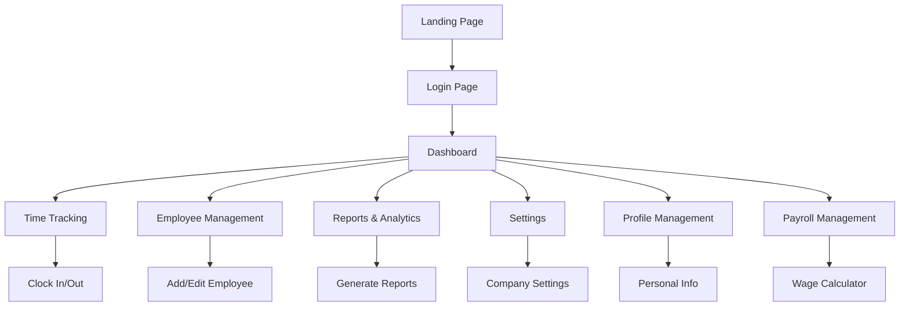

# Employee Time Tracking System - Product Requirements Document

## 1. Product Overview
A comprehensive employee time tracking system that enables organizations to monitor employee attendance, manage work hours, and generate detailed reports. The system supports role-based access for administrators, HR personnel, and employees with features for clock-in/out, payroll calculation, and attendance analytics.

The system addresses the need for accurate time tracking, automated payroll processing, and compliance with labor regulations while providing real-time insights into workforce productivity.

## 2. Core Features

### 2.1 User Roles
| Role | Registration Method | Core Permissions |
|------|---------------------|------------------|
| Admin | Direct registration or HR invitation | Full system access, user management, all reports |
| HR | Admin invitation | Employee management, reports, payroll access |
| Employee | HR invitation or self-registration | Time tracking, personal reports, profile management |

### 2.2 Feature Module
Our employee time tracking system consists of the following main pages:
1. **Landing Page**: hero section, feature highlights, login/register navigation
2. **Dashboard**: role-based overview, quick stats, recent activities
3. **Time Tracking**: clock-in/out interface, current status, daily summary
4. **Employee Management**: employee list, profile management, role assignment
5. **Reports & Analytics**: attendance reports, payroll summaries, time analytics
6. **Settings**: system configuration, hourly rates, company policies
7. **Profile Management**: personal information, password change, preferences
8. **Payroll Management**: salary calculation, payment history, wage settings

### 2.3 Page Details
| Page Name | Module Name | Feature description |
|-----------|-------------|---------------------|
| Landing Page | Hero Section | Display company branding, system overview, call-to-action buttons for login/register |
| Landing Page | Features Overview | Showcase key features like time tracking, reporting, payroll integration |
| Landing Page | Navigation | Header with login/register buttons, footer with company information |
| Dashboard | Statistics Cards | Show current employees, attendance rate, pending requests, total hours |
| Dashboard | Quick Actions | Direct access to time tracking, reports, employee management |
| Dashboard | Recent Activity | Display recent clock-ins, approvals, system notifications |
| Time Tracking | Clock Interface | Large clock-in/out buttons with current time display |
| Time Tracking | Status Display | Show current work status, hours worked today, break time |
| Time Tracking | Daily Summary | List of today's entries, total hours, overtime calculation |
| Employee Management | Employee List | Searchable table with employee details, status, actions |
| Employee Management | Add/Edit Employee | Form for creating/updating employee profiles, role assignment |
| Employee Management | Bulk Actions | Import employees, bulk role changes, export employee data |
| Reports & Analytics | Attendance Reports | Generate reports by date range, employee, department |
| Reports & Analytics | Payroll Reports | Calculate wages, overtime, deductions, export payroll data |
| Reports & Analytics | Analytics Dashboard | Charts for attendance trends, productivity metrics |
| Settings | Company Settings | Configure company information, work hours, holidays |
| Settings | Rate Management | Set hourly rates by role, overtime rates, bonus structures |
| Settings | System Preferences | Time zone, date format, notification settings |
| Profile Management | Personal Info | Edit name, email, contact information, profile picture |
| Profile Management | Security | Change password, two-factor authentication, login history |
| Profile Management | Preferences | Theme selection, language, notification preferences |
| Payroll Management | Wage Calculator | Calculate daily/monthly wages based on hours and rates |
| Payroll Management | Payment History | View past payments, download pay stubs, tax information |
| Payroll Management | Deductions | Manage tax deductions, benefits, loan deductions |

## 3. Core Process
**Employee Flow:**
Employees log in and access their dashboard to view current status and quick stats. They navigate to time tracking to clock in/out and monitor daily hours. Employees can view their personal reports and manage their profile settings.

**HR Flow:**
HR personnel access the dashboard for workforce overview and pending approvals. They manage employees through the employee management section, generate comprehensive reports, and configure payroll settings. HR can also manage system settings and company policies.

**Admin Flow:**
Administrators have full system access including user role management, system configuration, and all reporting capabilities. They can manage company-wide settings, oversee all employee data, and configure system preferences.

## 4. User Interface Design
### 4.1 Design Style
- Primary colors: Blue (#3B82F6), Secondary: Green (#10B981), Accent: Purple (#8B5CF6)
- Button style: Rounded corners with subtle shadows and hover animations
- Font: Inter or system fonts, sizes 14px-24px for body text, 32px+ for headings
- Layout style: Card-based design with clean spacing, top navigation with sidebar for admin sections
- Icon style: Lucide React icons with consistent sizing and modern outline style

### 4.2 Page Design Overview
| Page Name | Module Name | UI Elements |
|-----------|-------------|-------------|
| Landing Page | Hero Section | Large background image, centered text overlay, gradient buttons with animations |
| Dashboard | Statistics Cards | Grid layout with colored cards, icons, hover effects, responsive design |
| Time Tracking | Clock Interface | Centered large buttons, real-time clock display, status indicators with colors |
| Employee Management | Employee List | Data table with search, filters, pagination, action buttons |
| Reports & Analytics | Charts | Interactive charts using Chart.js, date pickers, export buttons |
| Settings | Configuration Forms | Tabbed interface, form validation, save/cancel actions |

### 4.3 Responsiveness
The system is mobile-first responsive design with breakpoints for tablet and desktop. Touch-friendly interfaces for mobile time tracking with large buttons and swipe gestures. Desktop version includes sidebar navigation and multi-column layouts for efficient data management.