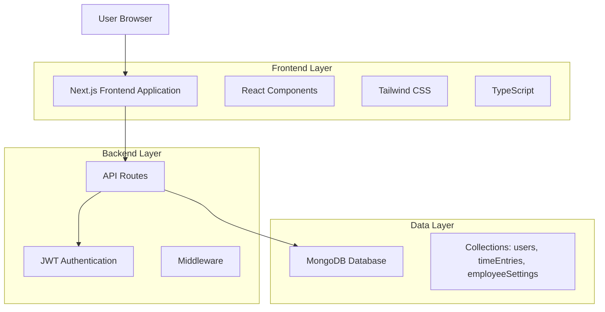
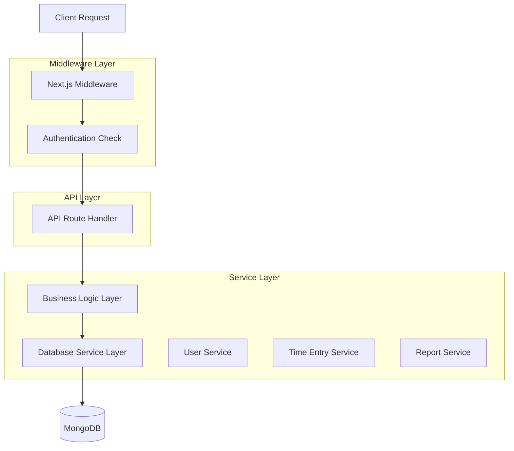
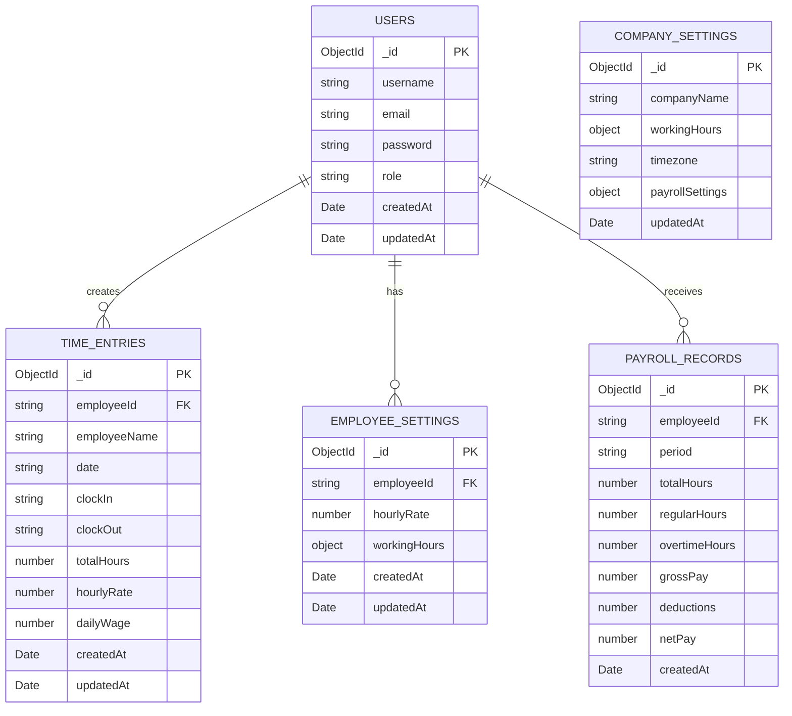

# Employee Time Tracking System - Technical Architecture Document

## 1. Architecture Design



## 2. Technology Description

* Frontend: Next.js\@14 + React\@18 + TypeScript + Tailwind CSS\@3 + Lucide React Icons

* Backend: Next.js API Routes + JWT Authentication

* Database: MongoDB with native driver

* Styling: Tailwind CSS with custom theme configuration

* State Management: React hooks and context for theme management

## 3. Route Definitions

| Route               | Purpose                                                            |
| ------------------- | ------------------------------------------------------------------ |
| /                   | Landing page with system overview and navigation to login/register |
| /login              | User authentication page                                           |
| /register           | User registration page                                             |
| /dashboard          | Role-based dashboard with statistics and quick actions             |
| /time-tracking      | Time clock interface for employees to clock in/out                 |
| /employees          | Employee management page (HR/Admin only)                           |
| /employees/\[id]    | Individual employee profile and settings                           |
| /reports            | Reports and analytics dashboard                                    |
| /reports/attendance | Detailed attendance reports with filters                           |
| /reports/payroll    | Payroll calculation and export functionality                       |
| /settings           | System configuration and company settings                          |
| /settings/rates     | Hourly rate management for different roles                         |
| /profile            | User profile management and preferences                            |
| /payroll            | Payroll management and wage calculation                            |
| /logout             | User logout and session cleanup                                    |

## 4. API Definitions

### 4.1 Core API

**Employee Management**

```
GET /api/employees
```

Response:

| Param Name | Param Type  | Description               |
| ---------- | ----------- | ------------------------- |
| employees  | Employee\[] | Array of employee objects |
| total      | number      | Total number of employees |
| page       | number      | Current page number       |

```
POST /api/employees
```

Request:

| Param Name | Param Type | isRequired | Description                        |
| ---------- | ---------- | ---------- | ---------------------------------- |
| username   | string     | true       | Employee username                  |
| email      | string     | true       | Employee email address             |
| role       | string     | true       | Employee role (admin/HR/employees) |
| hourlyRate | number     | false      | Default hourly rate                |

**Reports API**

```
GET /api/reports/attendance
```

Request:

| Param Name | Param Type | isRequired | Description                        |
| ---------- | ---------- | ---------- | ---------------------------------- |
| startDate  | string     | false      | Start date for report (YYYY-MM-DD) |
| endDate    | string     | false      | End date for report (YYYY-MM-DD)   |
| employeeId | string     | false      | Filter by specific employee        |

**Settings API**

```
PUT /api/settings/company
```

Request:

| Param Name   | Param Type | isRequired | Description                          |
| ------------ | ---------- | ---------- | ------------------------------------ |
| companyName  | string     | true       | Company name                         |
| workingHours | object     | true       | Standard working hours configuration |
| timezone     | string     | true       | Company timezone                     |

## 5. Server Architecture Diagram



## 6. Data Model

### 6.1 Data Model Definition



### 6.2 Data Definition Language

**Extended Users Collection**

```javascript
// Additional indexes for users collection
db.users.createIndex({ "role": 1 });
db.users.createIndex({ "email": 1 });
db.users.createIndex({ "createdAt": -1 });
```

**Payroll Records Collection**

```javascript
// Create payroll_records collection with validation
db.createCollection("payroll_records", {
  validator: {
    $jsonSchema: {
      bsonType: "object",
      required: ["employeeId", "period", "totalHours", "grossPay"],
      properties: {
        employeeId: { bsonType: "string" },
        period: { bsonType: "string" },
        totalHours: { bsonType: "number", minimum: 0 },
        regularHours: { bsonType: "number", minimum: 0 },
        overtimeHours: { bsonType: "number", minimum: 0 },
        grossPay: { bsonType: "number", minimum: 0 },
        deductions: { bsonType: "number", minimum: 0 },
        netPay: { bsonType: "number", minimum: 0 },
        createdAt: { bsonType: "date" }
      }
    }
  }
});

// Create indexes for payroll_records
db.payroll_records.createIndex({ "employeeId": 1 });
db.payroll_records.createIndex({ "period": 1 });
db.payroll_records.createIndex({ "createdAt": -1 });
```

**Company Settings Collection**

```javascript
// Create company_settings collection with validation
db.createCollection("company_settings", {
  validator: {
    $jsonSchema: {
      bsonType: "object",
      required: ["companyName", "workingHours", "timezone"],
      properties: {
        companyName: { bsonType: "string" },
        workingHours: {
          bsonType: "object",
          properties: {
            startTime: { bsonType: "string" },
            endTime: { bsonType: "string" },
            workDays: { bsonType: "array" }
          }
        },
        timezone: { bsonType: "string" },
        payrollSettings: {
          bsonType: "object",
          properties: {
            overtimeThreshold: { bsonType: "number" },
            overtimeMultiplier: { bsonType: "number" }
          }
        },
        updatedAt: { bsonType: "date" }
      }
    }
  }
});

// Initialize default company settings
db.company_settings.insertOne({
  companyName: "Your Company Name",
  workingHours: {
    startTime: "09:00",
    endTime: "17:00",
    workDays: ["Monday", "Tuesday", "Wednesday", "Thursday", "Friday"]
  },
  timezone: "UTC",
  payrollSettings: {
    overtimeThreshold: 8,
    overtimeMultiplier: 1.5
  },
  updatedAt: new Date()
});
```

**Reports and Analytics Indexes**

```javascript
// Additional indexes for reporting performance
db.time_entries.createIndex({ "date": 1, "employeeId": 1 });
db.time_entries.createIndex({ "date": 1, "createdAt": -1 });
db.employee_settings.createIndex({ "hourlyRate": 1 });
```

